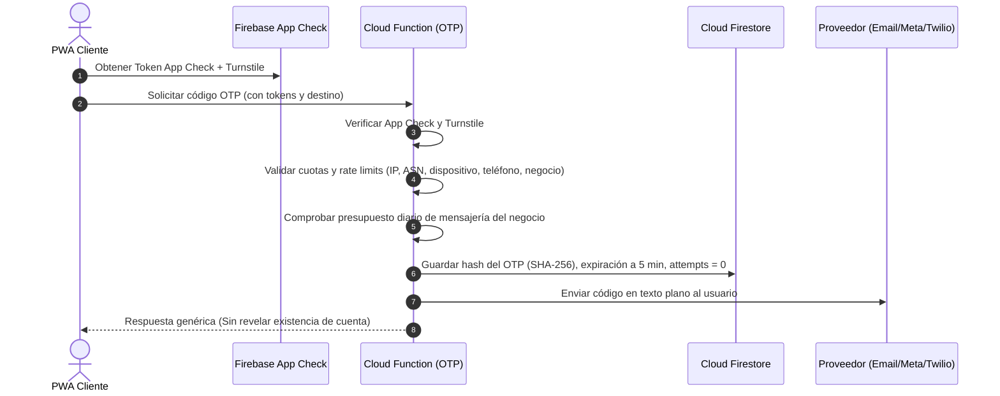

# AGENTS.md — Constitución Arquitectónica y Directrices del Sistema

Este documento es la **fuente de verdad absoluta e innegociable** para la arquitectura, seguridad, flujos de negocio y desarrollo operativo de **NIGHTFLOW VIP**. Todos los agentes de IA (Antigravity, OpenCode, Claude Code, Cursor, etc.) y desarrolladores humanos deben acatar estrictamente estas especificaciones.

---

## 1. Stack Tecnológico & Infraestructura

* **Frontend:** React 19 + TypeScript + Vite 8.
* **Estilos:** Vanilla CSS con variables de diseño, glassmorphism, temas oscuros de alta gama (estética club/discoteca VIP, acabados neón y dorados elegantes). Cero estética genérica ("AI Slop"); consulta obligatoria a **[frontend-design](.agents/skills/frontend-design/SKILL.md)**.
* **Identidad & Autenticación:** Firebase Authentication (MFA/WebAuthn para administración; identidad global particionada).
* **Base de Datos Principal:** Cloud Firestore (Multi-tenant estricto; **Realtime Database queda 100% retirada**).
* **Almacenamiento:** Firebase Storage con validación de aislamiento por `businessId`.
* **Backend Asíncrono & Serverless:** Cloud Functions 2nd Gen (Node.js / TypeScript).
* **Servicio Crítico de Puerta & Alta Concurrencia:** Cloud Run dedicado (región Ecuador / latencia p95 < 300–500 ms).
* **Gestión Criptográfica:** Google Cloud KMS con firma asimétrica (Ed25519 / ES256).
* **Emuladores & Testing:** Firebase Emulator Suite (Auth, Firestore, Storage, Functions).
* **Iconografía & Linter:** `lucide-react`, Oxlint (`oxlint`), TypeScript estricto (`tsc -b`).

### Puertos y Modos de Ejecución
* **Ambos servicios:** `npm run dev` (ejecuta concurrentemente Cliente y Admin).
* **Modo Cliente (VIP / Invitados):** `npm run dev:client` -> Puerto `5173`.
* **Modo Administrador / Staff:** `npm run dev:admin` -> Puerto `5174`.
* **Verificación de Tipos / Build:** `npm run build`.
* **Linter:** `npm run lint`.

---

## 2. Arquitectura Multi-Tenant & Aislamiento de Identidad

### 2.1 Identidad Global Unificada con Partición Local
Un correo electrónico o número telefónico genera un único `uid` en Firebase Authentication, pero los datos operativos están estrictamente particionados por negocio:

```text
users/{uid}                                         <-- Solo identidad global autenticada
businessDirectory/{businessId}                      <-- Directorio público (solo lectura limitada)
businesses/{businessId}/customers/{uid}             <-- Ficha, historial, tags y estado en este club
businesses/{businessId}/reservations/{reservationId}<-- Reservas e inventario del club
businesses/{businessId}/loyalty/{uid}               <-- Puntos y nivel VIP en este club
businesses/{businessId}/staff/{uid}                 <-- Roles y permisos del personal en este club
businesses/{businessId}/securityIncidents/{id}      <-- Registro de auditoría y colisiones
```

* Un negocio **jamás** puede consultar o indexar documentos de otro negocio.
* Los planes se asocian al negocio; el tipo de negocio (*discoteca, bar, lounge, rooftop*) activa módulos operativos específicos en la interfaz.

### 2.2 Separación del Directorio Público
* `businessDirectory/{businessId}` contiene únicamente los 9 campos públicos no sensibles: `name`, `slug`, `city`, `businessType`, `logoUrl`, `coverUrl`, `status`, `verified`, `authMethods` (necesario para resolver los métodos de acceso habilitados en `/acceso`).
* **Nunca** expondrá métricas financieras, planes, listados de clientes, personal ni reservas.

### 2.3 Custom Claims Mínimos (< 300 bytes)
El token JWT de Firebase Auth solo contiene datos de alcance global para evitar exceder el límite de 1 KB y evitar problemas de caché:
```json
{
  "platformRole": "customer | tenant_staff | superadmin",
  "claimsVersion": 2
}
```
* **Prohibido** almacenar arrays de negocios o roles granulares en los Claims.
* El `businessId` se valida contra la ruta solicitada y el documento `businesses/{businessId}/staff/{uid}` mediante reglas de seguridad de Firestore.
* Para operaciones de puerta se emite una sesión corta por dispositivo y negocio, firmada y revocable.

---

## 3. Flujo del Cliente & Privacidad de Favoritos

1. **Ruta `/` (Portada):** Buscador (por nombre, ciudad o tipo) y sección **Mis Favoritos** (si existen).
   * **Cero recomendaciones automáticas:** Un negocio solo aparece en la portada si el usuario lo marcó manualmente con el corazón.
   * **Almacenamiento Local de Favoritos:** Se guardan exclusivamente en el `localStorage` del dispositivo (`businessId`, `slug`, nombre, logo). Sin tokens, sin reservas y sin información personal. Sin sincronización forzada entre dispositivos ni rastreo no autorizado.
2. **Ruta `/negocio/:slug`:** Página de marca del establecimiento, eventos vigentes, tipos de accesos y características.
3. **Ruta `/negocio/:slug/acceso`:**
   * Opciones: Correo y contraseña, Código por correo (canal principal), Código por WhatsApp o SMS (opcionales por negocio).
   * Tras la autenticación, se vincula el `uid` global con la ficha local `businesses/{businessId}/customers/{uid}`.
   * Solo con la sesión activa se habilitan compras, holds y visualización de reservas.

---

## 4. Protección y Seguridad de OTP

Todos los canales de código temporal siguen el mismo embudo de mitigación de fraude (*toll fraud* / SMS pumping):



* **Límites de Código:** Máximo 3 intentos de verificación antes de invalidación inmediata; expiración estricta de 5 minutos; un solo uso (*single-use*).
* **Circuit Breaker:** Si se detecta un pico anómalo de peticiones por ASN o IP, el canal de pago (SMS/WhatsApp) se desactiva automáticamente para ese negocio, degradando a correo electrónico gratuito.

---

## 5. Módulo Crítico de Puerta (Cloud Run & Criptografía Asimétrica)

### 5.1 Servicio Dedicado en Cloud Run
Un microservicio multi-tenant dedicado gestiona exclusivamente:
* Validación online de pases.
* Confirmación transaccional de check-in.
* Sincronización de colas offline.
* Idempotencia por `ticketId` y `jti`.
* Emisión de sesiones de dispositivo de staff y rotación de claves públicas (`kid`).
* **SLA de Rendimiento:** Verificación criptográfica local `< 50 ms`. Confirmación online p95 `< 300–500 ms`.
* **Escalado:** `minInstances: 1` 24/7; escalado automático agresivo entre las 00:30 y 02:00 AM.

### 5.2 Formato del Pase JWS (Asimétrico Ed25519 / ES256)
La clave privada reside exclusivamente en Cloud KMS / Cloud Run. La PWA de puerta solo descarga el conjunto de claves públicas verificadas:
```json
{
  "header": { "alg": "EdDSA", "kid": "nightflow-key-2026-q1" },
  "payload": {
    "iss": "nightflow",
    "aud": "nightflow-door",
    "sub": "reservationId",
    "jti": "tokenId_unico",
    "businessId": "club_barahunda",
    "eventId": "evt_sabado_vip",
    "venueId": "venue_main",
    "deviceId": "dev_cust_mobile",
    "iat": 1774310400,
    "nbf": 1774310400,
    "exp": 1774310445,
    "tokenVersion": 1
  }
}
```

### 5.3 QR Dinámico y Prevención del "Pantallazo" (Screenshot Re-send)
* **Rotación en Cliente:** Afirmación rotativa firmada por Cloud Run con ventana de 30 segundos y `exp` máximo de 45 segundos.
* La PWA del cliente precarga el siguiente token para tolerar intermitencias de red.
* El halo animado en pantalla es únicamente soporte visual de orientación; **la seguridad reside en la validez temporal del JWS y la firma de hardware**.

---

## 6. Máquina de Estados de Presencia & Protocolo de Reingreso

### 6.1 Transición de Estados
```text
ABSENT ──(Check-In inicial)──> INSIDE ──(Salida Temporal)──> OUTSIDE_TEMPORARY ──(Reingreso con Passkey)──> INSIDE
                                 ▲                                   │
                                 └───────────────────────────────────┘
```
Cada transición registra: `timestamp`, `deviceId`, `doorId`, `staffUid` y `localSequence`.
* Si el pase está en `INSIDE`, un segundo escaneo es rechazado con: *«El titular ya está dentro del establecimiento»*.

### 6.2 Flujo Criptográfico de Reingreso (Anti-Transferencia por Passkey)
1. Al salir temporalmente (fumar, llamada, auto), el portero marca el pase en la PWA como `OUTSIDE_TEMPORARY`.
2. Se registran `leftAt` y `reentryExpiresAt` (ventana predeterminada: 30 minutos).
3. La PWA genera un desafío **WebAuthn / Passkey** vinculado al enclave de seguridad del teléfono original.
4. Para reingresar, el cliente presenta el pase y el dispositivo debe firmar con la passkey registrada en el primer ingreso. **Una captura de pantalla o video reenviado por WhatsApp es incapaz de generar la firma de hardware.**
5. Si el dispositivo no soporta passkeys, se aplica el protocolo fallback de revisión manual o manilla física.
6. Si la ventana de tiempo expira, el escáner muestra advertencia de tiempo superado y requiere pago de cover o autorización expresa del administrador.

### 6.3 Operación Offline y Colisiones entre Múltiples Puertas
* **Con Red Local:** Un gateway **NIGHTFLOW Edge** en la red interna del club actúa como autoridad temporal (descubrimiento por mDNS, sincronización por mTLS / WebSocket).
* **Aislamiento Total (Sin LAN ni Internet):** Si dos puertas están totalmente incomunicadas físicamente:
  * El sistema permite el ingreso provisional basado en la firma válida del JWS y almacena el evento en **IndexedDB cifrada**.
  * Al recuperar conectividad, Cloud Run ejecuta la transacción de sincronización con idempotencia por `jti`.
  * **Regla Innegociable ante Colisiones:** El segundo ingreso offline detectado genera un documento en `securityIncidents` y dispara una **alerta roja en el panel de seguridad del administrador**. **Bajo ninguna circunstancia se aplicará un cobro o sanción automática al cliente**; todo evento duplicado pasa a revisión manual por el personal del club.

---

## 7. Inventario y Ciclo de Vida de Reservas (Holds)

```text
AVAILABLE ──(Hold temporal 12 min)──> HELD ──(Inicio de pasarela)──> PAYMENT_PENDING ──(Webhook OK)──> CONFIRMED
                                        │                                   │
                                        └──(Timeout / Abandono)─────────────┴──(Fallo pasarela)──> EXPIRED / AVAILABLE
```

* **Duración del Hold:** Exactamente 12 minutos según la hora sincronizada del servidor.
* **Liberación de Stock:** Programada y ejecutada al segundo exacto mediante **Google Cloud Tasks**. La funcionalidad de Firestore TTL se utiliza únicamente como recolector de basura diferido.
* **Cálculo de Disponibilidad:** La disponibilidad de mesas o boletos se evalúa en tiempo real comparando `expiresAt` con el timestamp del servidor en una transacción, impidiendo sobreventas incluso si la tarea de liberación sufre retrasos.
* **Pagos Tardíos:** Si el webhook de pago llega cuando el hold ha expirado y el stock ya fue tomado por otro cliente, el sistema genera automáticamente un saldo a favor, reembolso o ticket de soporte; **nunca sobreventa automática**.

---

## 8. Botón de Pánico y Revocación Escalonada

* **Guardia de Seguridad:**
  * Bloqueo inmediato de la terminal asignada.
  * Alerta SOS en tiempo real a la central de seguridad.
  * Invalidación temporal de su sesión de escáner.
* **Administrador / Responsable del Club (Requiere 2FA):**
  * Cancelación de emergencia de un evento.
  * Revocación masiva de sesiones de staff emitidas antes de la hora `T`.
  * Bloqueo selectivo de un pase o terminal comprometida.
* **Superadministrador de Plataforma:**
  * Intervención de emergencia a nivel de tenant o evento global.
* **Mecanismo Técnico:** Pases y sesiones incorporan `revocationVersion`. Cloud Run rechaza tokens con versiones inferiores a la versión activa del evento o negocio. Las terminales se actualizan mediante WebSocket, FCM o sincronización de Edge.

---

## 9. Privacidad y Cumplimiento Legal (LOPDP Ecuador)

De conformidad con los Artículos 15, 18 y 19 de la Ley Orgánica de Protección de Datos Personales de Ecuador, el derecho de eliminación no es absoluto cuando existen obligaciones legales, tributarias o contractuales de retención:

### Proceso de Eliminación de Cuenta y Anonimización:
1. Verificación fehaciente de la identidad del solicitante.
2. Identificación de todos los negocios donde el usuario registra interacciones.
3. Eliminación irreversible de la ficha local (`businesses/{businessId}/customers/{uid}`), historial de navegación, tags y preferencias.
4. Revocación inmediata de tokens, sesiones activas, dispositivos y passkeys.
5. **Conservación y Anonimización Fiscal:** Los comprobantes de pago y facturas en `reservations/` **no se borran**. Se anonimizan de forma irreversible sustituyendo nombres, cédulas, correos, teléfonos, biometría, IPs y tokens de pago por un seudónimo contable (`subjectPseudonym`), preservando exclusivamente fecha, monto, impuestos y número de comprobante.
6. Registro de la solicitud en un log de cumplimiento (`privacyRequests/{requestId}`) sin almacenar PII original.
7. Eliminación de la identidad global (`users/{uid}`) únicamente cuando ningún negocio mantenga una base legal activa de retención.

---

## 10. Bloqueos Actuales a Erradicar Obligatoriamente

Antes de habilitar producción, deben eliminarse los siguientes antipatrones del código actual:
* **Login local sin verificación:** [`src/store/authManager.ts:3`](file:///d:/PROYECTOS/PARA%20DISCOTECAS/src/store/auditManager.ts) (debe migrarse a Firebase Auth real).
* **Cambio de rol desde la interfaz:** [`src/store/clubStore.ts:165`](file:///d:/PROYECTOS/PARA%20DISCOTECAS/src/store/clubStore.ts) (los roles se asignan exclusivamente desde el servidor en `businesses/{businessId}/staff/{uid}`).
* **Acceso simulado de staff:** [`src/components/common/StaffAccessModal.tsx:14`](file:///d:/PROYECTOS/PARA%20DISCOTECAS/src/components/common/StaffAccessModal.tsx).
* **Pasarela de pago simulada:** [`src/components/client/checkout/PaymentMethodSelector.tsx:17`](file:///d:/PROYECTOS/PARA%20DISCOTECAS/src/components/client/checkout/PaymentMethodSelector.tsx).
* **QR estático sin criptografía:** [`src/components/client/identity/BlackCardVipPass.tsx:146`](file:///d:/PROYECTOS/PARA%20DISCOTECAS/src/components/client/identity/BlackCardVipPass.tsx).

---

## 11. Batería Obligatoria de Pruebas "Escenario 02:00 AM"

Ningún módulo pasa a producción sin superar con éxito las siguientes 12 pruebas automatizadas en Firebase Emulator Suite y Cloud Run:
1. **Captura y reenvío de QR:** Comprobar que un screenshot enviado por mensajería falla al expirar la ventana de 45s o al carecer del token rotativo.
2. **Reingreso con persona distinta:** Comprobar que un segundo usuario no puede reingresar con el pase si el dispositivo no posee la Passkey original.
3. **Reingreso legítimo:** Validar reingreso exitoso con la passkey correcta dentro de los 30 minutos de gracia.
4. **Dos porteros offline en puertas distintas:** Validar que ambas puertas permitan el ingreso provisional, que al reconectar se detecte la duplicidad por `jti`, se cree el incidente y **no se penalice automáticamente al cliente**.
5. **Tres porteros conectados a red local:** Validar que el NIGHTFLOW Edge coordina los ingresos y rechaza el segundo pase antes de tocar la nube.
6. **Sincronización duplicada por pérdida de ACK:** Validar que el reintento de la cola offline no duplica el aforo gracias a la clave idempotente.
7. **Veinte compras simultáneas de la misma mesa VIP:** Validar que solo una transacción obtiene el hold de 12 minutos y las 19 restantes reciben notificación de no disponibilidad sin sobreventa.
8. **Pago recibido tras la expiración del hold:** Validar que se rechaza la confirmación y se enruta a reembolso o saldo a favor.
9. **Robo de terminal de guardia:** Ejecutar el botón de pánico de la terminal y verificar que todas las solicitudes posteriores son rechazadas de inmediato.
10. **Evento cancelado durante operación offline:** Validar que al subir la revocación de versión, las terminales rechazan el acceso en cuanto reciben la notificación.
11. **Solicitud de eliminación LOPDP:** Validar que la ficha personal se destruye pero el comprobante fiscal queda preservado bajo `subjectPseudonym`.
12. **Agotamiento de cuota OTP:** Validar que un ataque de fuerza bruta activa el circuit breaker y no consume el presupuesto diario de SMS/WhatsApp del negocio.

---

## 12. Orden Final de Implementación (10 Fases)

1. **Fase 1:** Configurar Firebase Auth, Cloud Firestore, Firebase Emulator Suite, App Check y retirar Realtime Database.
2. **Fase 2:** Crear modelo de datos de identidad global (`users`), directorio público (`businessDirectory`) y colecciones privadas por `businessId`.
3. **Fase 3:** Desplegar Cloud Functions para OTP seguro, envío de correos, gestión de roles y notificaciones.
4. **Fase 4:** Crear servicio Cloud Run, integración con Cloud KMS (Ed25519) y lógica de validación de pases.
5. **Fase 5:** Construir el directorio público, buscador y sistema de favoritos locales en la interfaz cliente.
6. **Fase 6:** Construir páginas de marca (`/negocio/:slug`) y conectar `/negocio/:slug/acceso` directamente a Firebase Auth.
7. **Fase 7:** Implementar transacciones de reservas, holds con Cloud Tasks y webhooks de pago reales.
8. **Fase 8:** Construir la PWA de puerta para staff, colas de sincronización IndexedDB y soporte NIGHTFLOW Edge.
9. **Fase 9:** Ejecutar la batería de pruebas de penetración y estrés del "Escenario 02:00 AM".
10. **Fase 10:** Auditoría de seguridad final y despliegue a producción.

---

## 13. Criterios de Aceptación Innegociables
* Custom Claims inferiores a 300 bytes.
* Cero lecturas o filtraciones de datos entre negocios distintos.
* Ningún rol, pago ni check-in modificable o escribible directamente desde el cliente.
* Todo QR alterado, vencido o duplicado debe ser rechazado.
* Cola offline cifrada y sincronizada una sola vez de forma idempotente.
* Cloud Run y Cloud Functions sin secretos ni claves privadas expuestas en los bundles públicos.
